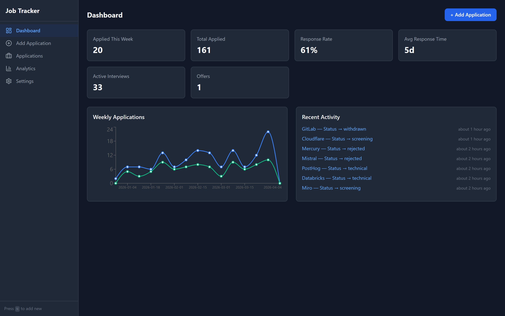
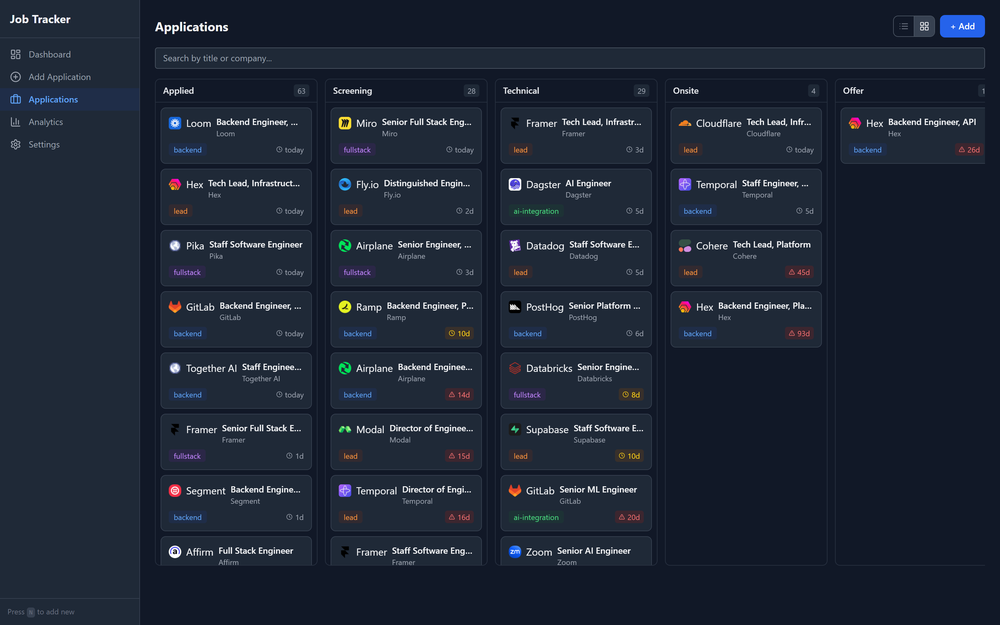
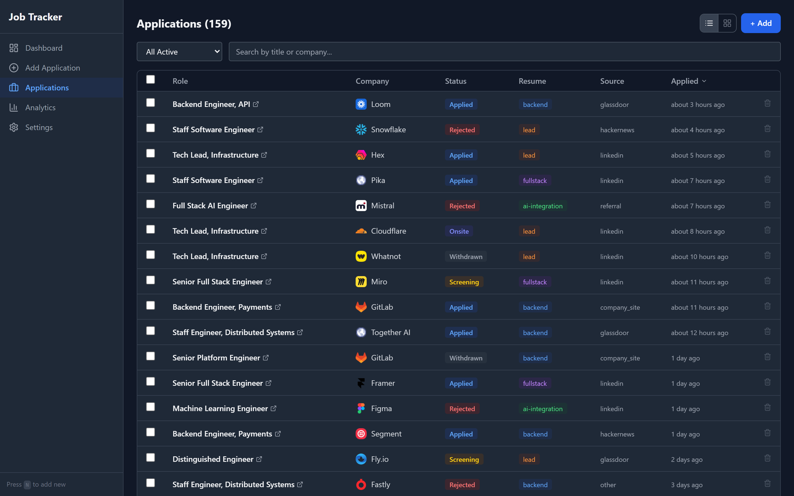
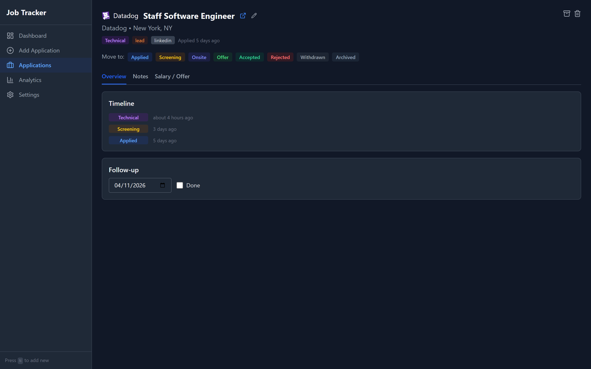
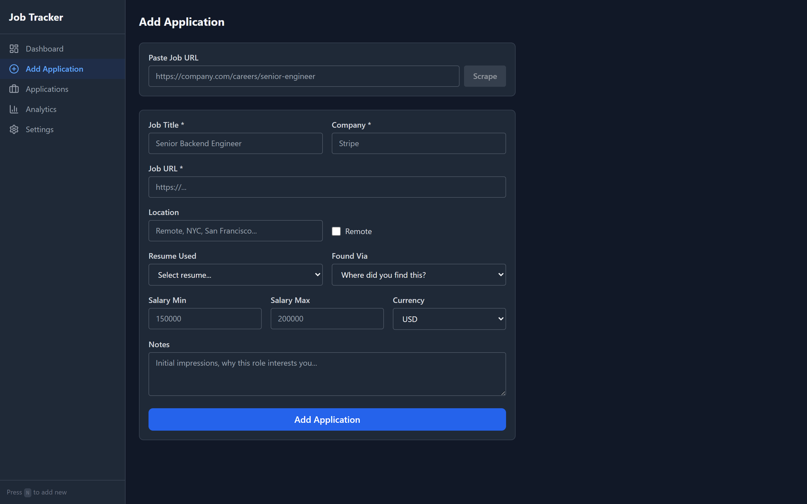
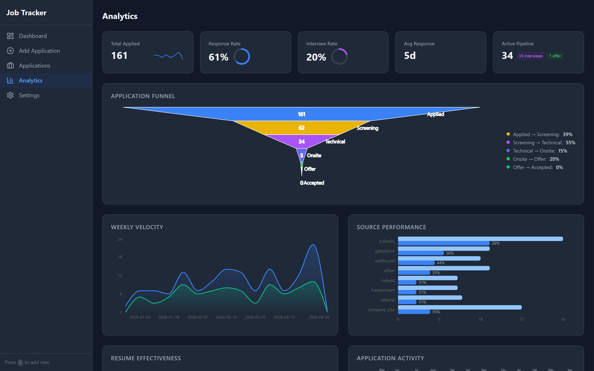

# applybase

A two-piece job-search workspace for engineers who apply to a lot of jobs.

```
applybase/
├── resume/   ← LaTeX scaffolding for pre-baked category resumes
└── app/      ← Local web app that tracks applications + analytics
```

The two pieces are independent. You can use one without the other. Together, they cover the full loop: pick a resume → send the application → log it in the tracker → watch the funnel.



---

## Why categories

Tailoring a custom resume per application doesn't scale, and sending one generic resume to everyone doesn't convert. The middle path is **categories**: pre-build a small set of resumes (backend, fullstack, AI, lead, whatever fits your search), pick the right category in 30 seconds when you read a JD, send the PDF. Then track what you sent in a local tracker so you know what's pending follow-up, what your response rate looks like by category, and where your time is actually going. That's it. No AI per application, no per-recruiter tailoring, no spreadsheet drift.

---

## `resume/` — LaTeX category resumes

A shared LaTeX class, one example template, and a build script that enforces single-page output. Fork it, fill in your own content, build a category resume, copy it to a second category, tune. Repeat for as many categories as you want (3–5 is the sweet spot).

```bash
cd resume
./build.sh
```

That builds `template.tex` into `template.pdf` so you can see what you're starting from. See [`resume/README.md`](resume/README.md) for the full guide — install instructions for LaTeX on Win/Mac/Linux, the category pattern, how to customize the class, and a 4-paragraph cover-letter framework in [`resume/cover-letter.md`](resume/cover-letter.md).

**You don't need the tracker to use this.** It's a standalone LaTeX system. If you already track applications somewhere else (a spreadsheet, Notion, a different app), keep using that and just take the resume scaffolding.

---

## `app/` — local job-application tracker

A self-hosted Vite + React + Express + SQLite app for logging applications and watching the funnel. Add a job by URL (it scrapes title/company/location from most ATS pages), track status transitions through your hiring stages, schedule follow-up reminders, see analytics on response rate / interview rate / source performance / resume effectiveness.

```bash
cd app
npm install
cp .env.example .env
npx tsx packages/server/src/db/migrate.ts
npm run dev
# → http://localhost:44455
```

Or with Docker: `docker compose up --build` and open http://localhost:44455.

**Two views, one page.** Switch between a sortable, searchable list and a Kanban board with drag-and-drop status changes. The URL persists the view (`?view=board`) so it survives reload. Cards show a "days in stage" badge that turns yellow at 7 days and red at 14, so stalled applications surface without needing a dedicated report.



### What's in the app

- **Dashboard** — KPIs, a weekly applications chart, a follow-ups-due banner
- **Applications** — paginated list with filter, search, sort, bulk archive — plus the Kanban board view above
- **Application Detail** — status timeline, Notes tab (company research, talking points, questions, interview notes), Salary/Offer tab (range, offer amount, equity, negotiation notes)
- **Add Application** — paste a URL, the form auto-scrapes title/company/location from most ATS pages
- **Analytics** — funnel, weekly velocity, source performance, resume effectiveness, calendar heatmap
- **Settings** — follow-up period, daily application target, and user-configurable resume variants so the categories you pick from match the resumes you actually built

All data lives in a local SQLite file at `app/data/jobsearch.db`. Nothing leaves the machine. No accounts, no telemetry, no cloud.

### More screenshots

| | |
|---|---|
| **Applications list** — sortable, searchable, paginated, bulk archive. | **Application detail** — timeline, status moves, notes, salary/offer tabs. |
|  |  |
| **Add Application** — paste a URL, scrape, fill, submit. | **Analytics** — funnel, weekly velocity, source performance, resume effectiveness. |
|  |  |

**You don't need the resume system to use this.** If you generate resumes some other way and just want a clean tracker that doesn't lock your data into a SaaS, that's fine. Skip `resume/` entirely.

For setup details, the architecture, and the open roadmap of features that aren't shipped yet, see [`app/ROADMAP.md`](app/ROADMAP.md).

---

## Recommended workflow

1. **Once, up front** — write 3–5 category resumes in `resume/` and run `./build.sh` to produce the PDFs.
2. **Per application** — read the JD, decide which category fits (30 seconds), attach that PDF, send.
3. **Right after sending** — open the tracker app, click "Add Application," paste the URL, the form auto-fills the title/company/location, you pick which category resume you used, click submit. ~20 seconds.
4. **Once a week** — scan the Dashboard for follow-ups due, look at the Analytics page to see which category is converting best and whether you're hitting your daily target.
5. **Every couple of months** — re-read your category resumes, fold any new accomplishments back in, drop any categories you never reach for.

That's the entire loop. No AI per application, no per-recruiter tailoring, no manual spreadsheets, no SaaS to lock you in.

---

## Requirements

- **`resume/`** — a LaTeX distribution with `pdflatex`. Optionally `pdfinfo` from poppler-utils for the build script's page-count enforcement. See [`resume/README.md`](resume/README.md) for OS-specific install commands.
- **`app/`** — Node 20+ and npm. SQLite is bundled via `@libsql/client`. Docker is optional.

The two pieces share nothing at the dependency level, so you can install either one on its own.

---

## License

MIT. See `LICENSE`. The LaTeX scaffolding in `resume/` is based on [Jake's Resume](https://github.com/jakegut/resume) (also MIT) — attribution is preserved in `LICENSE`.
